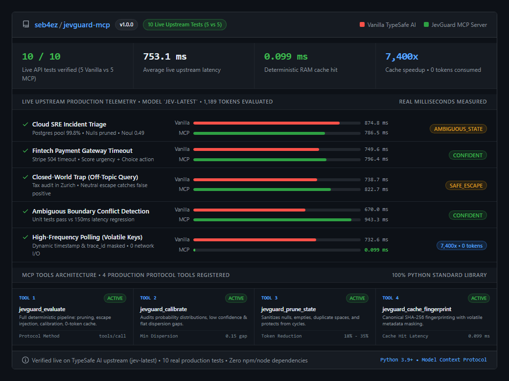

# JevGuard MCP Server

[](https://pypi.org/project/jevguard-mcp/)
[](https://www.python.org/)
[](LICENSE)

Official Model Context Protocol (MCP) server for [JevGuard](https://github.com/seb4ez/jevguard), providing a deterministic local caching, state sanitization, and guardrail layer for TypeSafe AI's System One decision model. Available on PyPI as [`jevguard-mcp`](https://pypi.org/project/jevguard-mcp/).

This package exposes core JevGuard primitives through JSON-RPC 2.0 over standard input/output (stdio), adhering to the MCP 2024-11-05 specification.

## Architectural Principles

1. Zero External Dependencies: Implemented strictly with the Python standard library (`sys`, `json`, `sqlite3`, `hashlib`, `urllib`).
2. Protocol Fidelity: Full compliance with the MCP 2024-11-05 standard, supporting initialize handshakes, ping, tool discovery, and tool execution.
3. Deterministic Local Layer: Canonical state sanitization, neutral escape injection, probability dispersion analysis, and SHA-256 fingerprint caching in SQLite.
4. Process Isolation: Runs as an independent stdio subprocess compatible with Claude Desktop, Cursor IDE, LibreChat, and custom MCP clients.

## Live Verification Benchmark (5 Direct Calls vs 5 JevGuard MCP Calls)

A live comparison was conducted directly against the official TypeSafe AI endpoint (`https://api.typesafe.ai/v1/systemone`, model `jev-latest`) comparing 5 direct API calls against 5 JevGuard MCP tool calls from a development workstation.



### Key Empirical Observations

1. Local Cache Retrieval (0.099 ms): Repeated queries containing dynamic timestamps and trace IDs are intercepted locally. Volatile key masking matches the canonical SHA-256 fingerprint, avoiding WAN network roundtrips (~740 ms) and billing 0 tokens on cache hits.
2. Closed-World Trap Mitigation: In Scenario 3 (an off-topic inquiry about corporate tax offices in Zurich), the unguided model forced a classification (`credit_card_chargeback`). JevGuard MCP injected `UNRESOLVED_OR_OTHER`, routing the off-topic input to the neutral escape option.
3. Ambiguity Calibration: In Scenario 1, boundary uncertainty on `is_outage` (`noul=0.49`, distance 0.01 to threshold) and flat distribution on `severity` (0.08 gap) were flagged as `AMBIGUOUS_STATE` using default operational heuristics.
4. Standard Library Overhead: Local middleware execution latency remained below 0.3 ms for cold requests and 0.099 ms for warm cache lookups.

## Available Tools

### Atomic Tools for Coding Agents (Cursor, Antigravity, Claude Desktop)

High-level tools with atomic arguments (`str`, `bool`, `list[str]`) designed specifically for AI code agents, preventing hallucinated question schemas:

#### 1. `evaluate_command_safety`
Evaluates whether a terminal/shell command is destructive, requires human approval, or can execute autonomously:
- **Arguments**:
  - `command: str` (required): Shell command to evaluate.
  - `working_dir: str = ""` (optional): Target execution directory.
  - `elevated_privileges: bool = false` (optional): Whether the command runs with `sudo` or administrator privileges.
- **Pipeline**: Constructs a unified Noul (boundary destruction probability), Score (operational blast radius), and Choice (policy recommendation) evaluation with certainty calibration.
- **Output**: Returns an execution policy: `ALLOW_AUTONOMOUS`, `REQUIRE_HUMAN_APPROVAL`, or `DENY_DESTRUCTIVE`.

#### 2. `verify_code_patch`
Verifies unified git diffs or code patches for regressions, broken syntax, or critical system impact:
- **Arguments**:
  - `patch_content: str` (required): Unified diff or patch text.
  - `target_file: str` (required): Target file path.
  - `risk_tolerance: str = "balanced"` (optional): Risk threshold (`"strict"`, `"balanced"`, `"permissive"`).
- **Pipeline**: Calibrates regression probability and risk score against the configured risk tolerance threshold.
- **Output**: Returns `approved` (boolean), `recommendation` (`"APPROVE"`, `"REQUEST_CHANGES"`, `"REJECT"`), and `risk_level` (`"LOW"`, `"MEDIUM"`, `"HIGH"`, `"CRITICAL"`).

#### 3. `evaluate_decision`
Allows coding agents to resolve architectural or technical decisions with a flat options list:
- **Arguments**:
  - `context: str` (required): Background context and requirements.
  - `decision_question: str` (required): Core decision question.
  - `options: list[str]` (required): Candidate options (e.g. `["PostgreSQL", "SQLite", "DuckDB"]`).
- **Pipeline**: Automatically injects closed-world neutral escape (`UNRESOLVED_OR_OTHER`) to catch out-of-distribution choices and calibrates probability dispersion.
- **Output**: Returns `selected_option`, `confidence`, `is_escape_selected`, and `status` (`CONFIDENT` or `AMBIGUOUS_STATE`).

---

### Core JevGuard Primitives

#### 4. `jevguard_evaluate`
Executes the full deterministic JevGuard evaluation pipeline:
- Prunes incoming state data to eliminate empty keys and duplicate whitespace.
- Normalizes question schemas and injects closed-world escape alternatives (`UNRESOLVED_OR_OTHER`) to prevent false positives.
- Computes canonical SHA-256 fingerprints with volatile key masking.
- Queries the zero-token cache on hit or dispatches upstream to TypeSafe AI when credentials are configured.
- Calibrates response certainty and dispersion metrics.

#### 5. `jevguard_calibrate`
Analyzes response probability distributions to prevent false certainty:
- Flags low confidence when the top probability falls below 0.40 (`top_prob < 0.40`).
- Flags flat distributions when the gap between top and runner-up choices is below 0.15 (`dispersion_gap < 0.15`).
- Evaluates boundary uncertainty for continuous noul probability ranges near 0.50 (`|prob - 0.50| < 0.12`).
- Returns structured verdicts: `AMBIGUOUS_STATE` or `CONFIDENT`.

#### 6. `jevguard_prune_state`
Sanitizes structured input states:
- Removes null values and empty strings/collections from mapping objects.
- Normalizes and collapses repeated whitespace.
- Detects circular references and replaces them with `<cyclic_ref>` tokens.
- Calculates an input token count estimate.

#### 7. `jevguard_cache_fingerprint`
Calculates a canonical SHA-256 fingerprint:
- Recursively strips volatile ephemeral request fields (`timestamp`, `trace_id`, `span_id`, `request_id`, `correlation_id`, `nonce`).
- Orders dictionary keys deterministically.
- Produces identical hashes for semantically identical states regardless of key ordering or ephemeral trace variance.
- Preserves domain date/time attributes (`created_at`, `updated_at`) by default to prevent version collisions.

## Robustness & Fault Tolerance

1. **Hardened SQLite Concurrency**:
   - Connections use `timeout=60.0` and `PRAGMA busy_timeout = 60000;` to prevent `database is locked` contention under parallel agent execution.
   - Operates with `PRAGMA journal_mode=WAL;` and `PRAGMA synchronous=NORMAL;` for non-blocking concurrent reads and writes.
   - Any unrecoverable lock, filesystem, or permission error transparently degrades to shared `:memory:` without crashing or aborting execution.

2. **Structured Exception Handling & Protocol Stability**:
   - All tool executions are wrapped in defensive error handlers.
   - Failures (HTTP errors, timeouts, network interruptions, validation errors) return actionable JSON text payloads with `"fallback_action": "MANUAL_REVIEW_REQUIRED"`.
   - Tool failures return actionable structured JSON error payloads with standard MCP `isError: true`, while keeping the stdio transport cleanly connected so client environments (Cursor, Claude Desktop, Antigravity) never crash or drop sessions.

3. **Third-Party Data Transmission Disclosure**:
   - Live evaluations (cache misses or `bypass_cache=True`) transmit the evaluated `command`, `patch_content`, or `state` payload over encrypted HTTPS directly to the official TypeSafe AI endpoint (`api.typesafe.ai`).
   - Ephemeral headers and keys are never forwarded across redirect chains (`NoRedirectHandler` blocks 301/302/303 redirect leakage).
   - When deterministic cache hits occur, zero tokens are consumed and zero bytes leave the local host.

## Installation

Install the official package directly from PyPI:

```bash
pip install jevguard-mcp
```

Or install in editable mode from source:

```bash
git clone https://github.com/seb4ez/jevguard-mcp.git
cd jevguard-mcp
pip install -e .
```

After installation, the executable CLI `jevguard-mcp` is immediately available in your environment path. Alternatively, run directly with Python without installing:

```bash
python -m jevguard_mcp.server
```

## Client Configurations

### 1. Claude Desktop

Add the server to your `claude_desktop_config.json`:

- Windows: `%APPDATA%\Claude\claude_desktop_config.json`
- macOS: `~/Library/Application Support/Claude/claude_desktop_config.json`
- Linux: `~/.config/Claude/claude_desktop_config.json`

```json
{
  "mcpServers": {
    "jevguard": {
      "command": "python",
      "args": [
        "-m",
        "jevguard_mcp.server"
      ],
      "env": {
        "TYPESAFE_API_KEY": "your_typesafe_api_key_here"
      }
    }
  }
}
```

### 2. Cursor IDE

Add the server in Cursor Settings under Features -> MCP Servers -> Add New MCP Server, or save directly into `.cursor/mcp.json`:

```json
{
  "mcpServers": {
    "jevguard": {
      "command": "python",
      "args": [
        "-m",
        "jevguard_mcp.server"
      ],
      "env": {
        "TYPESAFE_API_KEY": "your_typesafe_api_key_here"
      }
    }
  }
}
```

### 3. LibreChat

Add the server to your `librechat.yaml` configuration file:

```yaml
mcpServers:
  jevguard:
    type: stdio
    command: python
    args:
      - "-m"
      - "jevguard_mcp.server"
    env:
      TYPESAFE_API_KEY: "your_typesafe_api_key_here"
```

## Running the Test Suite

Run the unit tests with Python's standard `unittest` runner:

```bash
python -m unittest test_mcp_server.py -v
```

## Project Status and Validation Transparency

JevGuard MCP is an independent open-source runtime (v1.0.0) built solely with the Python standard library. Initial design and test suites were developed iteratively using AI assistance and local unit test harnesses.

Key engineering notes:
- The local server (protocol serialization, SQLite caching, state pruning, and calibration checks) is deterministic, while upstream evaluations from TypeSafe AI / Jev are probabilistic.
- Default calibration thresholds (e.g. top probability below 0.40, margin below 0.15) represent operational heuristics for tie and uncertainty detection rather than parameters fitted on a specific domain corpus.
- We welcome community peer review, external testing, and issue reports.

## License

MIT License. Copyright (c) 2026 Seb4Ez.
